  

# 

  
   
  

👋 Hi, i’m **Sergio**, a cybersecurity enthusiast with a passion for programming.

❤️ I love **programming** and **cybersecurity**, everything I know I **learned on my own**, and it is something I am proud of, as I have developed a great **ability** to learn new things every day.

💤 I learned to program one day when I was 10 years old **because I was bored**, from then on, I developed a **great passion** for cybersecurity and I usually program in my free time for **FreeBSD**, **Debian** and **Nmap Project** or on my **personal projects**.

🇪🇸 I'm live in Spain

🕵️‍♂️ Offer various services dedicated to IT that you can see on my website

🚀 CEO [CyberForecast®](https://cyberforecast.pages.dev/)

🌐 You can learn more about me on my website: [s3rgi09.github.io](https://s3rgi09.github.io/)

📨 You can contact me via: 

Telegram: [@s3r_gx0](https://t.me/s3r_gx0)

E-mail: [s3rgi09@iname.com](mailto://s3rgi09.iname.com) (Without PGP)
